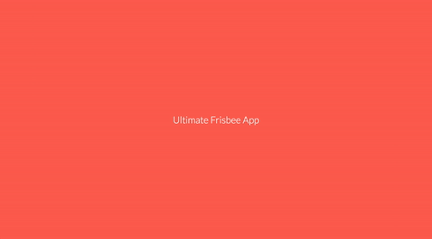
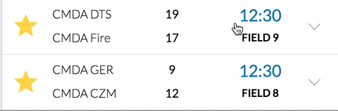

# Ultimate Frisbee App - Melvin
*This is the individual readme of Melvin Reijnoudt. In this document you can see my contributions to this project on a weekly basis. You can also see used techniques from each course of the minor Everything Web and read a bit about my experience during this project. For an in-depth overview of the contributions by Fons and Senny, you can go to their personal readme's:*

- [Go to the individual README of contributor Fons Hettema](https://github.com/strexx/Ultimate-Frisbee-App/blob/master/README_fons.md)
- [Go to the individual README of contributor Senny Kalidien](https://github.com/sennykalidien/Ultimate-Frisbee-App)

The main readme of the repository can be found here:

 [Go to the repository's main README](https://github.com/strexx/Ultimate-Frisbee-App)
 
## Table of content
1. [About UFA](#about-ufa)
  1. [UFA](#ufa)
  2. [Problem](#problem)
  3. [Design problem](#design-problem)
  4. [Use cases](#use-cases)
2. [Technical information](#technical-information)
  1. [Main functionalities](#main-functionalities)
  2. [The structure](#the-structure)
  4. [How to install](#how-to-install)
  5. [How to develop](#how-to-develop)
3. [Individual](#individual)
  1. [Tasks per week](#tasks-per-week)
  2. [Used techniques from courses](#used-techniques-from-courses)
  3. [Important contributions explained](#important-contributions-explained)
  4. [Collaboration](#collaboration)
 
##About UFA
> Beforehand I would like to note that everything you need to know about the application can be found at the [main repository's README](https://github.com/strexx/Ultimate-Frisbee-App).

###UFA
The Ultimate Frisbee App started as a school assignment for the Amsterdam University of Applied Sciences, at the study of Communication and Multimedia Design. Christian Schaffner, a frisbee fanatic and the client for this assignment, had the wish to have a mobile app that can keep scores for the Ultimate Frisbee tournaments.

See the application live at: [https://meesterproef.directzichtbaar.nl](https://meesterproef.directzichtbaar.nl).

###Problem
The public and frisbee fans at Ultimate Frisbee tournaments currently have a hard time keeping track of scores. There is no clear source of information that you can use on the go, or at least at a field. Aside from this, the tournament organizations themselves need a fast and secure solution for confirming and storing final scores.

The teams need to know when and where they are playing, and against whom.

###Design problem
*How can a mobile web application allow the organization of the Ultimate Frisbee tournaments to receive the (final) scores of a finished match instantly and at the same time serve the public viewers and the teams with real-time (score) updates and other info about the matches during a tournament.*

### Use cases
#### Must haves
1. As a user I want to have real-time score updates about a match or multiple matches (that I'm interested in).
2. As a user I want to have an overview of the matches that are being played during the tournament and on which field.
3. As a user I want to update the scores of my (favorite) team(s).
4. As a user I want to follow my favorite teams.
5. As a user I want to be able to visit the app, even if I have a bad internet connection.
6. As a scorekeeper of a game I want to confirm the final score, so the score can be updated in the system (Leaguevine API).
7. As a scorekeeper I want to see the matches that are relevant to me.

#### Could haves
1. As a user I want to be notified if a (favorite) team scores.
2. As a user I want to view the scores on a public screen.
3. As a scorekeeper I want to have a personal overview of all the teams that I need to keep the scores for during the tournament.
4. As a team I want to fill in my sprit scores.
5. As a client I want to receive the spirit scores into the Leaguevine API.


##Technical information
### Main functionalities
The application's main functionalities are built using:

- Node.js
- MongoDB
- Socket.io
- Gulp

###How to install
A small tutorial on how to install the Node application on your own local machine.

**Git repository**:
[https://github.com/strexx/Ultimate-Frisbee-App.git](https://github.com/strexx/Ultimate-Frisbee-App.git)

#### 1 - Clone the repository
```
git clone https://github.com/strexx/Ultimate-Frisbee-App.git
```

#### 2 - Navigate to the cloned repository

```
cd <path/to/file>
```

#### 3 - Install the node modules and packages
```
npm install
```

#### 4 - Start Gulp to create a dist folder

```
gulp
```

#### 5 - Start the application
```
npm start
```

#### 6 - View the app in the browser
The app will be listening to port 3010. Open the browser and go to either ``http://127.0.0.1:3010`` or ``http://localhost:3010``


### How to develop
- Changes to the server side files can be modified in the folders of the root.
- Changes to the client side CSS and JS can be made in the public folder.
- HTML can be changed in the views folder

#### 1 - Use gulp watch to let Gulp watch for any changes
```
gulp watch
```

#### 2 - Use nodemon to automatically refresh the page on any changes

```
nodemon app.js
```

Open your browser and go to ``http://localhost:3010``


### The structure
```
├── connections                                 // Folder with database and socket.io connections setup
|    ├── database.js                            // Database connection setup
|    ├── socket.js                              // Web Sockets connection setup
├── lib                                         // Library folder
|    ├── mongodb.js                             // General database calls
|    ├── socket-io.js                           // Socket listeners with functionality
├── modules                                     // General modules setup
|    ├── formatDigits.js                        // Time formatting
|    ├── multiRequest.js                        // Multiple HTTP-requests handler
|    ├── uniqueKeys.js                          // Get unique values from an array
├── node_modules                                // Node modules
├── public                                      // Client side folder
|    ├── src                                    // Source folder
|    |    |── css                               // Styling for the application
|    |    |   ├── reset.css                     // Styling reset
|    |    |   ├── styles.css                    // Styling main file
|    |    ├── images                            // All images used in the application
|    |    ├── js                                // All client-side JavaScript logic
|    |    |   ├── appLauncher.js                // Main js file for launching app flow
|    |    |   ├── fontFaceObserver.js           // Font Face Observer functionality
|    |    |   ├── pages.js                      // Pages functionality
|    |    |   ├── router.js                     // Router functionality
|    |    |   ├── scores.js                     // Scores functionality
|    |    |   ├── serverWorker.js               // Service Worker functionality
|    |    |   ├── tools.js                      // Tools functionality
|    |    |   ├── ux.js                         // Ux behaviour functionality
|    |    ├── lib                               // Library folder
|    |    |   ├── fontfaceobserver.min.js       // Font Face Observer library
|    |    |   ├── modernizr.js                  // Modernizr library
|    |    |   ├── socket.io.min.js              // Socket.io library
|    ├── index.html                             // Basic HTML file for critical css
|    ├── sw.js                                  // Main Service Worker file
├── routes                                      // Routes folder
|    ├── api.js                                 // Servers api file with requests and database storage
|    ├── index.js                               // Page routing, rendering and data logic
├── scripts                                     // Scripts folder
|    ├── deploy                                 // Jenkins deploy bash script for server deployment
├── sessions                                    // All sessions stored when user logging in
├── views                                       // All views of the application, rendered with handlebars.
|    ├── partials                               // Partials
|    |    |── content                           // Partials content
|    |    |   ├── content_matches.hbs
|    |    |   ├── content_ranking.hbs
|    |    ├── footer                            // Partials footer
|    |    |   ├── footer_login.hbs
|    |    |   ├── footer_matches.hbs
|    |    |   ├── footer_tournaments.hbs
|    |    ├── header                            // Partials header
|    |    |   ├── header_login.hbs
|    |    |   ├── header_match.hbs
|    |    |   ├── header_matches.hbs
|    |    |   ├── header_tournament.hbs
|    |    |   ├── header_tournaments.hbs
|    |    ├── loader.hbs
|    |    ├── scripts.hbs
|    |    ├── splash.hbs
├── .gitignore                                  // Git ignore file
├── app.js                                      // Application bootstrap
├── gulpfile.js                                 // Gulp task managing configuration file
├── package.js                                  // Node.js installation file with dependencies
├── readme.md                                   // This readme file
```


#Individual
##Tasks per week


Things I've done to contribute to this project can be found at https://github.com/strexx/Ultimate-Frisbee-App/commits?author=melvinr

Aside from these commits I also contributed to a lot of commits done by Fons and Senny.

Below you can find a summary of the tasks I performed on a weekly basis, as well as a list of course related features I implemented.

###Week 1
- Briefing with the client.
- Think about what the application will need, what does the user want?
- Create a sitemap.
- Create wireframes per page.
- Join wireframes, take the best parts and create a new one from it.
- Create first sketches and iterate.
- Create a first design for the application.
- Created debriefing.

###Week 2
- Finish the first design.
- Recreated the design in HTML, CSS and Node.
- Find and implement google fonts.
- Research and testing at WindMill Tournament.
- Research for libraries and packages.
- Collaborated to make API calls and fetch data.
- Separated files into modules.
- Present first demo to Christian Schaffner.

###Week 3
- Created MoSCoW feature list.
- Progress meeting with teachers.
- Add feature list to Trello.
- Off-screen menu, along with transition and functionality.
- Research for mongoDB and help setup the database.
- Save matches to the database.

###Week 4
- Take out unnecessary libraries
- Help setting up server-side rendering
- Tab-toggle switch for server-side rendering instead of client-side
- Help setup database synchronization on remote server.
- Add feedback element when match has finished.
- Added LoadCSS.
- Setup and generated criticalcss using gulp.
- Created and implemented Service Worker.
- Redesign off-screen menu. Changed design pattern.
- Redesigned application.
- Implemented splash screen, along with logic (using local storage).
- Fixed realtime functionality.
- User testing.

###Week 5
- Made design and menu in particular responsive.
- Added fallback for flexbox using modernizr.
- Added logic for showing feedback after submitting as scorekeeper.
- Update one match from API, using mongoDB.
- Created matches on leaguevine for testing.
- Created readme.

###Week 6
- Added dropdown, including transition and design.
- Added favorites page and functionality.
- Added animation to favorites button.
- Helped create first draft of score update feedback.
- Show and hide menu when page loads, added button to get it back in view.

###Week 7
- Fixed Firefox layout bugs.
- Edited dropdown functionality: when opening a dropdown, close other dropdown.
- Edited readme.


###Weekly tasks
- Loggin hours on Harvest.
- Updating trello.
- Update process report.
- Update drive.

##Used techniques from courses
###CSS To The Rescue
------
####Flexbox
Used flexbox to create the application's layout. For the browsers that don't support flexbox I provided a fallback using modernizr. You can find the fallback file at ``/public/src/css/flexboxfallback.css``.

####Mobile First approach
All the features and design elements I created, were developed using the mobile first approach. This helped me to think about the core features and elements that the application needed.

####Centering
Centered elements both horizontally and vertically using ``display: flex`` and ``margin: auto``.

####Prefixes
Added prefixes to certain elements using autoprefixer.

####Custom checkbox
Created a custom checkbox as explained in Lea Verou's CSS Secrets. A part of the code:

```
.match__item__submit input[type=checkbox]+ label::before {
    /*Will function as styled checkbox*/
    content: '\a0';
    display: inline-block;
    vertical-align: .1em;
    width: 1.25em;
    height: 1.2em;
    font-size: 1.2em;
    margin-right: .2em;
    border-radius: .2em;
    background: silver;
    text-indent: .10em;
    line-height: 1.1;
}
```

####:after
Created small triangles to highlight the current page in the menu. I did this using the ``:after`` pseudo-class. In the end these triangles were deleted as we changed the menu's design.

####CSS transitions and animations
I created a splash screen using CSS animations and keyframes. I also created a transition that animated an off-canvas menu to show on-canvas, pushing the content to the side. In the end this menu was taken out because we decided to implement a different design pattern.

For the matches page, I created a dropdown using CSS transitions and added an animation to the favorites button.

I also created and made use of reusable classifications for elements. This made it easy to quickly style multiple elements the same way.

###Web App From Scratch
------
####IIFE and namespacing
We made use of IIFE's (Immediately Invoked Function Expression). Only the relevant parts that will be used outside of the scope will be returned.
We also used namespacing to ensure that if the namespace that we used already exists, the code will be joined. If the current namespace doesn't exist, it will be created.

``var UFA = UFA || {};``

####Client-side routing
Made use of the client-side hash routing that was already setup.

####Strict mode
Implemented ``'use strict'`` to ensure the use of valid JavaScript notation.

####Functional animations with hardware accelerated properties
I created a functional animation and transition using hardware accelerated properties. I used the properties: 

- transform: translate
- transform: rotate
- opacity

```
.matches__item__arrow__up {
    position: relative;
    width: 1em;
    height: 1em;
    margin: auto;
    transition: transform 1.5s 0.3s;
}
.footer__menu.active {
    transform: translateY(4em);
}
```

####Templating
I made use of the templating engine Handlebars to render the pages. This makes your pages dynamic, because it will inject the content it needs into the layout.

```
{{#if items }}
    <section id="favorites" class="matches__items">
        <div class="matches__division">
            {{#each items}}
                {{> content_matches}}
            {{/each}}
        </div>
    </section>
    {{ else }}
    <h1 class="header__message">{{ message }}</h1>
{{/if}}
```

####Data handling
Manipulated data that came from the API and rendered these in the right views.

```
findMatches(db, function() {
  res.render('favorites', {
      title: 'Favorites',
      items: favMatches
  });
});
```

####Get and Post requests
Made use of, edited and created get and post requests to the leaguevine API. An example of this is the get request to the favorites page.

####Changing scores
I created the functionality for the score buttons. Adding or subtracting from the score on certain button click. This data was sent to the API. Later on in the project we integrated MongoDB in the project, the buttons eventually sent this data to the database instead of the API.

###Performance Matters
------
####Gulp - Critical CSS
Made use of and edited gulp when needed. Edited the CriticalCSS gulp task to create critical css.

####LoadCSS
Implemented and setup load css for the asynchronous loading of CSS. This in combination with CriticalCSS led to a faster and better First Meaningful Render.


```
<link rel="preload" href="/dist/css/style.min.css" as="style" onload="this.rel='stylesheet'">
<noscript>
   <link rel="stylesheet" href="/dist/css/style.min.css">
</noscript>

<!-- LoadCSS -->
<script>
	!function(e){"use strict";var t=function(t,n,r){function f(e){return a.body?e():void setTimeout(function(){f(e)})}function u(){l.addEventListener&&l.removeEventListener("load",u),l.media=r||"all"}var o,a=e.document,l=a.createElement("link");if(n)o=n;else{var i=(a.body||a.getElementsByTagName("head")[0]).childNodes;o=i[i.length-1]}var d=a.styleSheets;l.rel="stylesheet",l.href=t,l.media="only x",f(function(){o.parentNode.insertBefore(l,n?o:o.nextSibling)});var s=function(e){for(var t=l.href,n=d.length;n--;)if(d[n].href===t)return e();setTimeout(function(){s(e)})};return l.addEventListener&&l.addEventListener("load",u),l.onloadcssdefined=s,s(u),l};"undefined"!=typeof exports?exports.loadCSS=t:e.loadCSS=t}("undefined"!=typeof global?global:this),function(e){if(e.loadCSS){var t=loadCSS.relpreload={};if(t.support=function(){try{return e.document.createElement("link").relList.supports("preload")}catch(t){return!1}},t.poly=function(){for(var t=e.document.getElementsByTagName("link"),n=0;n<t.length;n++){var r=t[n];"preload"===r.rel&&"style"===r.getAttribute("as")&&(e.loadCSS(r.href,r),r.rel=null)}},!t.support()){t.poly();var n=e.setInterval(t.poly,300);e.addEventListener&&e.addEventListener("load",function(){e.clearInterval(n)}),e.attachEvent&&e.attachEvent("onload",function(){e.clearInterval(n)})}}}(this);
</script>
```

####Semantic HTML and CSS
Wrote semantic HTML and CSS to boost the page's performance.

####BEM
Made use of the BEM notation for classes and id's. By using the BEM notation you make your project's code more organized. It's especially useful when in a group, since you will use one form of notation. Developers claim it helps with efficiency and how much code you eventually write. Which will subsequently improve your page's load time.

```
<div class="matches__division">
	<h1 class="matches__division__title">CMD Amsterdam</h1>
	<div class="matches__container">
	    {{#each liveCMD}}
	        {{> content_matches}}
	    {{/each}}
	</div>
</div>
```

###Real Time Web
------
####Real time aspect
Made use of socket.io to create the real time aspect of the application. In the end I fixed an important part of the real time aspect with the help of Robert van Steen.

####Mongo collections
Manipulated mongodb collections to save and delete data. This way we were able to give the application a significant speed boost, since it was no longer dependent on the speed of the LeagueVine API. The setup of the collections was a collaborative effort, but Fons and Senny setup the biggest part of the database and its collections.

###Browser Technologies
------
####Progressive enhancement
Made the application's core functionality available without JavaScript. The user gets a better experience with extra functionalities if JavaScript is turned on or the browser supports it.

####Check for color blindness
Looked at the application using the "SEE" extension for chrome. This way I was able to see if the application could be used by users with certain types of sight problems. The application was still easy to use. 

####Browser and device compatibility
The application was tested on a multitude of devices and browsers. Including an old version of Chrome for Android and the foreign UC Browser. The application looked fine and worked good on these browsers and most devices.

##Important contributions explained
###Splash Screen


I created this animation purely with CSS and HTML. For the HTML, I created a div which contains three elements, a top bar, a bottom bar and an h1:

```
<div class="splash">
	<div class="top-bar"></div>
	<h1 class="splashh1">Ultimate Frisbee App</h1>
	<div class="bottom-bar"></div>
</div>
```

The top-bar wil animate from left to right, and the bottom bar the other way around. When these animations have finished, they shrink in size, creating a visual trick as if the red, middle bar grows. Finally a line will be drawn underneath the h1, this was done using the `:after` pseudo-class. The entire CSS including the keyframes:

```
#splash {
    display: none;
    position: relative;
    height: 100%;
    background: #f04b51;
    top: 0;
    z-index: 10;
    padding: 0.4em;
}
#splash.active {
    display: flex;
    position: fixed;
    width: 100%;
}
.splash__text {
    margin: 0;
    color: white;
    margin: auto;
    font-size: 2em;
    position: relative;
}
.splash__text:after {
    display: block;
    position: absolute;
    left: 0;
    bottom: -10px;
    width: 100%;
    height: 10px;
    opacity: 0;
    background-color: #ffffff;
    content: "";
    animation: underlineTitle 0.5s 3s ease forwards;
}
.splash__top__bar {
    content: '';
    position: absolute;
    left: 0;
    top: 0;
    width: 100%;
    height: 40%;
    background: #FFFFFF;
    animation: slideRight 1.5s ease-in-out, shrink 1.5s 1.5s ease-in-out forwards;
}
.splash__bottom__bar {
    content: '';
    position: absolute;
    left: 0;
    bottom: 0;
    width: 100%;
    height: 40%;
    background: #ffffff;
    animation: slideLeft 1.5s ease-in-out, shrink 1.5s 1.5s ease-in-out forwards;
}
@keyframes slideRight {
    0% {
        transform: translateX(-100%);
    }
    67% {
        transform: translateX(0%);
    }
    100% {
        transform: translateX(0%);
    }
}
@keyframes slideLeft {
    0% {
        transform: translateX(100%);
    }
    67% {
        transform: translateX(0%);
    }
    100% {
        transform: translateX(0%)
    }
}
@keyframes shrink {
    0% {
        height: 40%;
    }
    100% {
        height: 0;
    }
}
@keyframes underlineTitle {
    0% {
        width: 0;
        opacity: 0;
    }
    10% {
        opacity: 1;
    }
    100% {
        width: 100%;
        opacity: 1;
    }
}
```

Finally I added 2 chunks of JavaScript code, one to show the splash screen:

```
function showSplash() {
    splashScreen.classList.add('active');
    setTimeout(function() {
        splashScreen.classList.remove('active');
    }, 4000)
}
```

And the other one is a check that makes sure that the splash screen is only shown the first time the user opens the app. This was done using localStorage:

```
function splashVisited() {
    var splashShown = localStorage.getItem("splashShown");
    if (!splashShown) {
        showSplash();
        localStorage.setItem("splashShown", "true");
    }
}
```

Then to make sure the function is executed on the homepage, I added it to the matchesLive function in pages.js:

```
function matchesLive() {
    UFA.scores.matchesInit();
    UFA.scores.changeHomeScores();
    UFA.ux.splashVisited();
    UFA.ux.toggleClass();
    UFA.ux.toggleDropdown();
}
```

###Post data when JS is disabled
Because we wanted to build the application progressive enhanced, it was vital that the application would be able to post match scores when JavaScript is not available or blocked. In order to do this, the scorepage had to be built using a form. In this form I added an action and a method, which basically tells the application what to do with the data it keeps:

```
<form class="match__item__form" action="/api/match/score" method="POST">
```

What this does, is that it will post the data to `/api/match/score`. This means that it will go to api.js and post it to the router which posts /match/score:

```
router.post('/match/score', function(req, res) {

    var post = req.body;

    if (post) {

        var score1 = parseInt(post.score_team_1),
            score2 = parseInt(post.score_team_2),
            gameID = parseInt(post.gameID),
            isFinal = false,
            userID = null;

        if (post.isFinal)
            isFinal = true;

        if (post.userID)
            userID = post.userID;

        var postData = JSON.stringify({
            game_id: parseInt(gameID),
            team_1_score: score1,
            team_2_score: score2,
            is_final: isFinal
        });

    } else {
        console.log("Error when posting data");
    }

    var updateMatch = function(db, callback) {
        var matchesCollection = db.collection('matches');
        matchesCollection.updateOne({
                id: gameID
            }, {
                $set: {
                    team_1_score: score1,
                    team_2_score: score2
                }
            },
            function(err, results) {
                if (err) {
                    console.log(err);
                } else {
                    callback();
                }
            });
    };

    updateMatch(db, function() {
        // Log if match is updated in database
        console.log("Match " + gameID + " updated.. new scores are " + score1 + " and " + score2);

        //If scorekeeper is logged in and score is final score > post to API
        if (userID && isFinal == true) {

            // Post url and headers
            var url = "https://api.leaguevine.com/v1/game_scores/",
                headers = {
                    'Content-Type': 'application/json',
                    'Accept': 'application/json',
                    'Authorization': 'bearer 40e50065ad'
                };

            // Post request
            request.post({
                url: url,
                body: postData,
                headers: headers
            }, function(req, res, body, err) {
                if (err) {
                    console.log(err);
                } else {
                    updateMatchFromApi(gameID);
                    console.log("Scorekeeper " + userID + " added new score");
                    var destination = '/match/' + gameID + '/?message=Match is succesfully updated with final score';
                    res.redirect(destination);
                }
            });

        } else {
            console.log("Regular user added new score");
            var destination = '/match/' + gameID + '?message=Match is succesfully updated';
            res.redirect(destination);
        }
    });
});
```

This block of code stores the body of a request in a variable called post. Then it will check if post is present. If it is, this means that a request has been sent. What it will do is store certain values from the request's body in variables. Then it will check if the score has been checked as final, and if a user has been logged in. It will store these values in a variable object which converts the strings and numbers to JSON values.

Next I created a function called updateMatch. From within this function I call the correct MongoDB collection and use `updateOne` to update one match. By using $set you tell mongo that only certain values need to be changed. Then I call the function and add functionality to post the score to the API if a user is logged in and checked isFinal.

###Filters that are pushed to a new array
```
findMatches(db, function() {

    // var now = dateFormat(Date.now(), "HH:MM");
        // var liveTime = String(now);

        var liveTime = "12:30",
            todayDate = "03-06-2016",
            session = req.session.user_id;

        //Filter on today's date
        var matchesToday = matches.filter(function(obj) {
            var currentDate = obj.start_time.split(" ")[0];
            return currentDate == todayDate;
        });

        for (var key in matchesToday) {
            if (matchesToday[key].start_time !== undefined) {
                matchesToday[key].start_time = matchesToday[key].start_time.split(" ")[1];
            }
        }

        // Filter on time
        var recentMatches = matchesToday.filter(function(obj) {
            return obj.start_time < liveTime;
        });
        var liveMatches = matchesToday.filter(function(obj) {
            return obj.start_time == liveTime;
        });
        var upcomingMatches = matchesToday.filter(function(obj) {
            return obj.start_time > liveTime;
        });

        // Filter on recent matches
        var recentWomen = recentMatches.filter(function(obj) {
            return obj.tournament_id == "20058";
        });

        var recentMixed = recentMatches.filter(function(obj) {
            return obj.tournament_id == "20059";
        });

        var recentOpen = recentMatches.filter(function(obj) {
            return obj.tournament_id == "20060";
        });

        var recentCMD = recentMatches.filter(function(obj) {
            return obj.tournament_id == "20297";
        });


        // Filter on live matches
        var liveWomen = liveMatches.filter(function(obj) {
            return obj.tournament_id == "20058";
        });

        var liveMixed = liveMatches.filter(function(obj) {
            return obj.tournament_id == "20059";
        });

        var liveOpen = liveMatches.filter(function(obj) {
            return obj.tournament_id == "20060";
        });

        var liveCMD = liveMatches.filter(function(obj) {
            return obj.tournament_id == "20297";
        });


        // Filter on upcoming matches
        var upcomingWomen = upcomingMatches.filter(function(obj) {
            return obj.tournament_id == "20058";
        });

        var upcomingMixed = upcomingMatches.filter(function(obj) {
            return obj.tournament_id == "20059";
        });

        var upcomingOpen = upcomingMatches.filter(function(obj) {
            return obj.tournament_id == "20060";
        });

        var upcomingCMD = upcomingMatches.filter(function(obj) {
            return obj.tournament_id == "20297";
        });


        // push objects in new array
        matchesfinal.push({
            "liveCMD": liveCMD
        }, {
            "liveWomen": liveWomen
        }, {
            "liveMixed": liveMixed
        }, {
            "liveOpen": liveOpen
        }, {
            "recentCMD": recentCMD
        }, {
            "recentWomen": recentWomen
        }, {
            "recentMixed": recentMixed
        }, {
            "recentOpen": recentOpen
        }, {
            "upcomingCMD": upcomingCMD
        }, {
            "upcomingWomen": upcomingWomen
        }, {
            "upcomingMixed": upcomingMixed
        }, {
            "upcomingOpen": upcomingOpen
        });

        res.render('matches', {
            title: 'Matches',
            items: matchesfinal,
            user: session
        });
    });
});
```

What this block of code does is the following: the function findMatches, which pushes matches from the database into an empty array called 'matches', is called. In the variable matchesToday, matches are filtered to only show todays matches. Subsequently this will be filtered and categorized under three categories, based on their start_time. recentMatches, liveMatches and upcomingMatches are then filtered again to categorize those matches under four categories which represent the division the matches are played in. This is done by checking their tournament ID. When this is done, all the new sub categories are pushed into the empty matchesFinal array as separate objects. Then this new array is rendered in HTML.

To make sure the right matches are rendered at the right place, this is how you make the references in Handlebars:

```
{{#items}}
    {{#if liveCMD}}
        <div class="matches__division">
          <h1 class="matches__division__title">CMD Amsterdam</h1>
          <div class="matches__container"> 
            {{#each liveCMD}}
                {{> content_matches}}
            {{/each}}
	     </div>
	    </div>
    {{/if}}
{{/items}}
```
Note that the `{{#items}}` block is placed around all the content in our project, not just around one division.

If you have inserted a new tournament in the database, just follow the code above and you will have the right content rendered on the right page in no time.

###Dropdown


To create this transition, I started off by creating the HTML. Look at it like this: you have a container, which contains another container that holds all the dropdown's content. This is done to create not only the dropdown transition, but also the fading in of the elements inside it.

```
<div class="matches__item__morph__container">
    <div class="matches__item__morph__content">
		<!--Your content goes here-->
    </div>
</div>
```

Now we have our HTML it's time to add our CSS:

```
.matches__item__morph__container {
    position: relative;
    top: 0;
    left: 0;
    height: 0;
    width: 100%;
    opacity: 1;
    background: #f9f9f9;
    -webkit-transition: height 0.5s cubic-bezier(0.7, 0, 0.3, 1);
    transition: height 0.5s cubic-bezier(0.7, 0, 0.3, 1);
}

/*hidden content before transition */

.matches__item__morph__content {
    opacity: 0;
    transition: opacity 0.4s 0s;
    display: flex;
    flex-flow: row wrap;
    justify-content: space-around;
    height: 100%;
}

/*div containing everything  */

.matches__item__morph__container.active {
    height: 5em;
}

/*hidden content after transition */

.matches__item__morph__container.active .matches__item__morph__content {
    transition: opacity 0.4s 0.5s;
    opacity: 1;
}
```
The important parts of the CSS are that you give the outer container a height of 0 and the content an opacity of 0. Then you add a transition to the elements containing the property you want to change, give them a duration a timing (easing). Next you create an active class for the elements, you can do this by chaining them to the element's class. This selector will hold the animated property's new value(s).

To finish the transition we need some JavaScript. The dropdown is activated when a match is clicked, by adding the `active` class:

```
var morphContainers = document.querySelectorAll('.matches__item__morph__container'),
matchesItemLinks = document.querySelectorAll('.matches__item__link');

function toggleDropdown() {
    [].forEach.call(matchesItemLinks, (link) => {
        link.addEventListener('click', function(e) {
            e.preventDefault();
            
            [].forEach.call(morphContainers, (singleContainer) => {
                var morphContainer = this.nextElementSibling;

                if (singleContainer == morphContainer) {
                    // arrowDropdown.classList.toggle('active');
                    singleContainer.classList.toggle('active');
                } else {
                    singleContainer.classList.remove('active');
                    // arrowDropdown.classList.toggle('active');
                }
            });
        });
    })
}
```
What this JavaScript block does is that, for each matches__item__link, it will add a click eventlistener. When one of these links is clicked, it will activate a function in which the default event is prevented. It will then loop through morphContainers, it checks the link'ss next sibling, which is the dropdown. If the singleContainer from the forEach loop matches `morphContainer`, it will toggle the active class on that element. Thus activating the transition.

###Setting favorites using cookies
In order to store the favorites and get data from the database, we had to set cookies. I created a new file called `favStorage.js`, which you can find under `public/src/js`. 

In here you will find the code that both sets and reads the cookies. The first part of the code is a function that does a regex search to get the value of a key. If the returned value equals `null`, a new empty array will be set. Otherwise it will parse this cookie as JSON.


```
function init() {

    function readCookie(key) {
        var nameEQ = key + "=";
        var ca = document.cookie.split(';');
        for (var i = 0, max = ca.length; i < max; i++) {
            var c = ca[i];
            while (c.charAt(0) === ' ') c = c.substring(1, c.length);
            if (c.indexOf(nameEQ) === 0) return c.substring(nameEQ.length, c.length);
        }
        return null;
    }
    
    
    var cookieID = readCookie("matchID");
    if (cookieID === null) {
        var arrayID = [];
    } else {
        var arrayID = JSON.parse(cookieID);
    }
```


After this we set a new variable that is used for dynamic adding of favorites. We then use a forEach loop that listens to all favorites button and when clicked it will store the match ID in the cookie. 

in the storeID function there is a check for duplicate ID's and a forEach loop that checks whether or not a certain ID is inside the cookie. If it is, it will add active to the favorite button, animating it and making it yellow. Clearly indicating that this match has been added to favorites.

At the end, the function that actually creates the cookie is defined and in the end this function is executed. 

```

// Create a new variable newArrayID for dynamic adding favorites.
var newArrayID = arrayID;

// Find button
var _favoriteButton = document.querySelectorAll('.favorite__btn');

// favorite button eventlistener
[].forEach.call(_favoriteButton, (button) => {
    button.addEventListener('click', storeID, false);
});


function storeID(event) {
    event.preventDefault()
    var clickedID = this.getAttribute('value');
    arrayID.push(clickedID);

    // Remove class
    this.classList.remove('pop--active');

    /*  CHECK FOR DUPLICATED ID's - src: https://jsfiddle.net/BumbleB2na/XvgTb/1/ */
    for (var h = 0; h < newArrayID.length; h++) {
        var curItem = newArrayID[h],
            foundCount = 0;
        // search array for item
        for (var i = 0; i < newArrayID.length; i++) {
            if (newArrayID[i] == arrayID[h])
                foundCount++;
        }
        if (foundCount > 1) {
            // remove repeated item from new array
            for (var j = 0; j < newArrayID.length; j++) {
                if (newArrayID[j] == curItem) {
                    newArrayID.splice(j, 1);
                    j = j - 1;
                }
            }
        }
    };

    // Check if ID is stored in array and make button active
    [].forEach.call(newArrayID, (ID) => {
        var _favoriteButtonID = document.querySelector('.favorite__btn[value="' + ID + '"]');
        if (_favoriteButtonID) {
            _favoriteButtonID.classList.add('pop--active');
        }
    });

    function createCookie(key, value, exp) {
        var date = new Date();
        date.setTime(date.getTime() + (exp * 24 * 60 * 60 * 1000));
        var expires = "; expires=" + date.toGMTString();
        document.cookie = key + "=" + value + expires + "; path=/";
    }

    var storeArrayID = JSON.stringify(newArrayID);
    createCookie('matchID', storeArrayID, 30);
	};
};

return {
	init: init
};
```


##Collaboration
The collaboration between Senny, Fons and myself was an absolute joy. All three of us were prepared to work hard and spend a lot of hours to develop the application, which we did. They have more experience and knowledge of web development than I do, so they would help me with certain pieces of code on multiple occasions. This enabled me to learn a lot from them.  

Our development process was great, we started off by defining what had to be done, for this we used Trello. Then we divided tasks and set off to execute and complete these tasks. On Github we created feature branches in which we would work. Before merging the changes made in a feature branch with master, we checked with each other if it was ok.

During the first two weeks of the project, we worked at school a lot. Separating ourselves from the crowd by working in a closed off room, we created the first version of the application. As time went by we noticed that we were more productive when working from home, something we did once a week. After this realization, we decided to start working from home. Almost always we would stay online in an appear.in room. This enabled us to ask questions so we could help one another. This way we made great steps and a lot of progress. Sometimes one of us would encounter a big problem that he couldn't tackle on his own, so we all pitched in by doing research and coming up with ways of tackling the problem. For me this was a really pleasant way of working, because this way we could fix problems the moment we encountered them.

Looking back at the project and our process, I wouldn't change a thing. The challenges we set for ourselves by using techniques none of us had used before, like node.js, socket.io and mongodb, turned out to be one of the best decisions we made. The process of learning new things whilst developing something for an actual client enabled me to learn a lot more.

