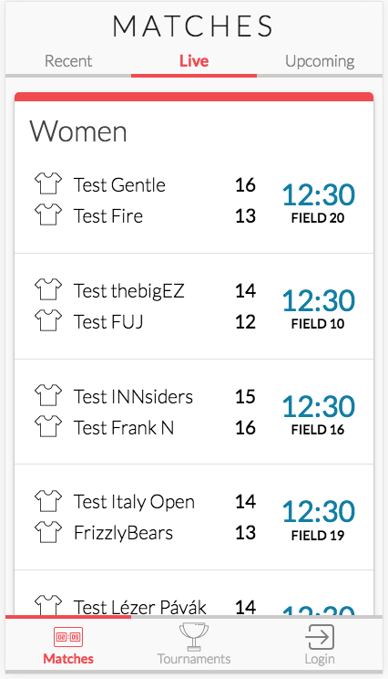
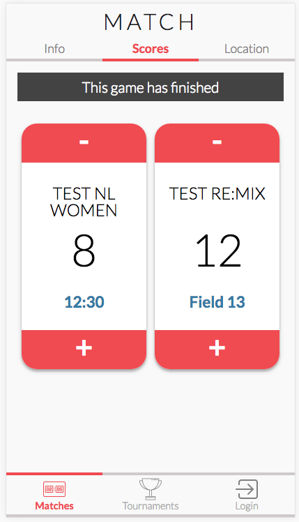
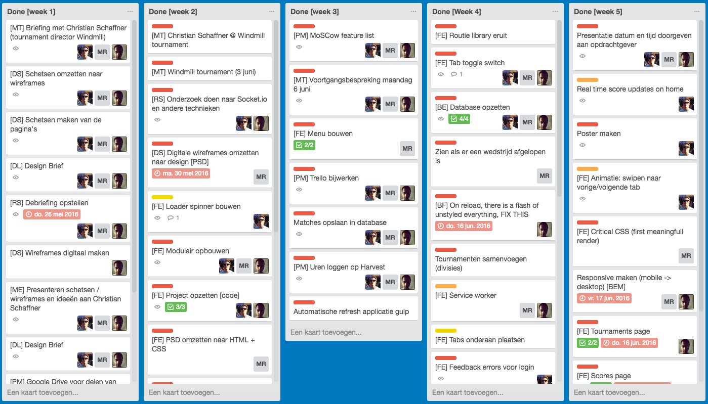

# Ultimate Frisbee App (UFA)
The Ultimate Frisbee App started as a school assignment for the Amsterdam University of Applied Sciences, at the study of Communication and Multimedia Design. This app is a web app, built in the popular platform Node.js. It's currently designed to show the latest matches for the Windmill Tournaments, which is a yearly event. The app uses the Leaguevine API for getting the scores and updating the score.

When using the app it will allow you to post scores to the app in real-time, which other users are able to see live without ever refreshing the page. That is just one of the many strenghts of this web app...

## Live demo
[https://www.meesterproef.directzichtbaar.nl](http://www.meesterproef.directzichtbaar.nl)

## Main functionalities
- Node.js
- MongoDB
- Socket.io
- Gulp

## The structure of the app
```
├── connections                                 // Folder with database and socket.io connections setup
|    ├── database.js                            // Database connection setup
|    ├── socket.js                              // Web Sockets connection setup
├── lib                                         // Library folder
|    ├── mongodb.js                             // General database calls
|    ├── socket-io.js                           // Socket listeners with functionality
├── modules                                     // General modules setup
|    ├── formatDigits.js                        // Time formatting
|    ├── multiRequest.js                        // Multiple HTTP-requests handler
|    ├── uniqueKeys.js                          // Get unique values from an array
├── node_modules                                // Node modules
├── public                                      // Client side folder
|    ├── src                                    // Source folder
|    |    |── css                               // Styling for the application
|    |    |   ├── reset.css                     // Styling reset
|    |    |   ├── styles.css                    // Styling main file
|    |    ├── images                            // All images used in the application
|    |    ├── js                                // All client-side JavaScript logic
|    |    |   ├── appLauncher.js                // Main js file for launching app flow
|    |    |   ├── fontFaceObserver.js           // Font Face Observer functionality
|    |    |   ├── pages.js                      // Pages functionality
|    |    |   ├── router.js                     // Router functionality
|    |    |   ├── scores.js                     // Scores functionality
|    |    |   ├── serverWorker.js               // Service Worker functionality
|    |    |   ├── tools.js                      // Tools functionality
|    |    |   ├── ux.js                         // Ux behaviour functionality
|    |    ├── lib                               // Library folder
|    |    |   ├── fontfaceobserver.min.js       // Font Face Observer library
|    |    |   ├── modernizr.js                  // Modernizr library
|    |    |   ├── socket.io.min.js              // Socket.io library
|    ├── index.html                             // Basic HTML file for critical css
|    ├── sw.js                                  // Main Service Worker file
├── routes                                      // Routes folder
|    ├── api.js                                 // Servers api file with requests and database storage
|    ├── index.js                               // Page routing, rendering and data logic
├── scripts                                     // Scripts folder
|    ├── deploy                                 // Jenkins deploy bash script for server deployment
├── sessions                                    // All sessions stored when user logging in
├── views                                       // All views of the application, rendered with handlebars.
|    ├── partials                               // Partials
|    |    |── content                           // Partials content
|    |    |   ├── content_matches.hbs
|    |    |   ├── content_ranking.hbs
|    |    ├── footer                            // Partials footer
|    |    |   ├── footer_login.hbs
|    |    |   ├── footer_matches.hbs
|    |    |   ├── footer_tournaments.hbs
|    |    ├── header                            // Partials header
|    |    |   ├── header_login.hbs
|    |    |   ├── header_match.hbs
|    |    |   ├── header_matches.hbs
|    |    |   ├── header_tournament.hbs
|    |    |   ├── header_tournaments.hbs
|    |    ├── loader.hbs
|    |    ├── scripts.hbs
|    |    ├── splash.hbs
├── .gitignore                                  // Git ignore file
├── app.js                                      // Application bootstrap
├── gulpfile.js                                 // Gulp task managing configuration file
├── package.js                                  // Node.js installation file with dependencies
├── readme.md                                   // This readme file
```

## How to install
A small tutorial how to install the Node application on your own local machine.

**Git repository**:
[https://github.com/strexx/Ultimate-Frisbee-App.git](https://github.com/strexx/Ultimate-Frisbee-App.git)

### 1 - Clone the repository
```
git clone https://github.com/strexx/Ultimate-Frisbee-App.git
```

### 2 - Navigate to the cloned repository

```
cd <path/to/file>
```

### 3 - Install the node modules and packages
```
npm install
```

### 3 - Start Gulp to create a dist folder with concatenated and minified files

```
gulp
```

### 4 - Start the application
```
npm start
```

### 5 - View the app in the browser
The app will be listening to port 3010. Open the browser and go to either ``http://127.0.0.1:3010`` or ``http://localhost:3010``


## How to develop
- Changes to the server side files can be modified in the folders of the root.
- Changes to the client side CSS and JS can be made in the public folder.
- HTML can be changed in the views folder

### 1 - Use gulp watch to let Gulp watch for any changes
```
gulp watch
```

### 1 - Use nodemon to automatically refresh the page on any changes

```
nodemon app.js
```

Open your browser and go to ``http://localhost:3010``


## Overview App
See below an overview op the used NPM packages and features.

### NPM packages
Overview of NPM packages / dependencies used to run the application.

Name                 | Version | Description
:------------------- | :------ | :----------
body-parser          | 1.15.0  | Body parsing middleware for node.js
dateformat        	 | 1.0.12  | Date formatting for node.js
express              | 4.13.4  | Fast, unopinionated, minimalist web framework
express-session      | 1.13.0  | Session middleware for Express
gsap 					 | 4.0.0   | Animation library
hbs      				 | 2.2.3   | Express.js template engine plugin for Handlebars
jsonfile             | 1.1.2   | Easily read/write JSON files.
mongodb              | 2.1.21  | The official MongoDB driver for node.js
password-hash        | 1.2.2   | Password hashing and verification for node.js
path          		 | 0.12.7  | Provides utilities for working with file and directory paths
request              | 2.72.0  | Simplified HTTP request client.
session-file-store   | 0.2.0   | Session file store is a provision for storing session data in the session
socket.io            | 1.4.6   | Node.js realtime framework server


## Feature list

### Per course
1. CSS to the rescue	
2. Web App From Scratch
3. Performance Matters
4. Real Time Web
5. Browser Technologies
6. EXTRA: Server Side

### Overview
| Feature                           | Course        |
| --------------------------------- | ------------- |
| Score functionality               | 2, 4, 5, 6    |
| Progressive Enhancement           | 5             |
| Tabs                              | 1, 2, 6       |
| MongoDB database                  | 2, 6          |
| User accounts (scorekeepers)      | 6             |
| CSS Animations and Transitions    | 1, 3, 5       |
| Real Time using socket.io         | 2, 4          |
| Service Worker                    | 2, 3, 5       |
| API                               | 2, 6          |
| Font Face Observer                | 3             |
| Critical CSS                      | 3             |
| LoadCSS                           | 3             |
| First meaningful render           | 3             |
| Login                             | 5, 6          |
| Feedback login (error page)       | 1, 2, 6       |
| Logout                            | 6             |
| User sessions                     | 6             |
| Tournament page                   | 1, 2, 6       |
| Menu design pattern               | 1             |
| Responsive                        | 1             |
| Gulp                              | 3             |
| Partials                          | 2             |
| Handlebars                        | 2, 4          |
| Feature detection                 | 2, 5          |
| Progressive Web App               | 6             |
| Multirequest                      | 2, 6          |
| Modules                           | 2, 3          |
| Jenkins                           | 3, 6          |
| FlexBox                           | 1, 5          |
| Modernizr                         | 1, 5          |
| BEM                               | 1, 3          |
| Checkbox                          | 1             |

### Future feature wishlist
- User type related content
- Cachebuster with gulp
- Add team color
- Comments and likes on matches
- Touch events
- Overview of games per field
- Current ranking on live results tab

## Changes made based on user testing and feedback:

- Changed design pattern, brought menu back on-canvas and fixed to the bottom.
- Changed position of "+" and "-" buttons, to make them easier to tap for the user.
- Created a visual difference between divisions by using material design cards.
- Added visual feedback when a score has been submitted.
- Added visual feedback when a game has finished.
- Added some information directly to the scorepage, instead of just under the info tab.
- Scrolling on the tournaments page was slow, so we changed the design, which made it easier to scroll.
- Added feedback to login.
- Added a final score checkbox, so the scorekeeper won't accidentally submit the score as final.
- Added round and tournament to info page.


## Screenshots




## Communication and planning tools

- [Trello](http://www.trello.com)
- [Google Drive](http://www.drive.google.com)
- [Telegram](http://www.telegram.com)
- [Appear](http://www.appear.in)
- [Slack](http://www.slack.com)
- [Harvest](http://www.harvest.com)

## Teamwork makes a dream work

"A lot of the application's functionality and structure was created as a result of a collaborative effort. The three of us communicated through appear.in and tackled most of the major functionalities as a team. We feel that our workflow and personal growth has had a lot of benefits from this way of working. Our personal development and motivation to work got a boost and in the end helped us to create an even better application."

### Contributors
- [Fons Hettema](https://github.com/strexx)
- [Melvin Reijnoudt](https://github.com/melvinr)
- [Senny Kalidien](https://github.com/sennykalidien)
- 

# Personal tasks per week



Things I've done to contribute to this project can be found at https://github.com/strexx/Ultimate-Frisbee-App/commits?author=melvinr

Besides these commits I also contributed to a lot of commits done by Fons and Senny.

Below you can find a summary of the tasks I performed on a weekly basis, as well as a list of course related features I implemented.

##Week 1
- Briefing with the client.
- Think about what the application will need, what does the user want?
- Create a sitemap.
- Create wireframes per page.
- Join wireframes, take the best parts and create a new one from it.
- Create first sketches and iterate.
- Create a first design for the application.
- Created debriefing.

##Week 2
- Finish the first design.
- Recreated the design in HTML, CSS and Node.
- Find and implement google fonts.
- Research and testing at WindMill Tournament.
- Research for libraries and packages.
- Collaborated to make API calls and fetch data.
- Separated files into modules.
- Present first demo to Christian Schaffner.

##Week 3
- Created MoSCoW feature list.
- Progress meeting with teachers.
- Add feature list to Trello.
- Off-screen menu, along with transition and functionality.
- Research for mongoDB and help setup the database.
- Save matches to the database.

##Week 4
- Take out unnecessary libraries
- Help setting up server-side rendering
- Tab-toggle switch for server-side rendering instead of client-side
- Help setup database synchronization on remote server.
- Add feedback element when match has finished.
- Added LoadCSS.
- Setup and generated criticalcss using gulp.
- Created and implemented Service Worker.
- Redesign off-screen menu. Changed design pattern.
- Redesigned application.
- Implemented splash screen, along with logic (using local storage).
- Fixed realtime functionality.
- User testing.

##Week 5
- Made design and menu in particular responsive.
- Added fallback for flexbox using modernizr.
- Added logic for showing feedback after submitting as scorekeeper.
- Update one match from API, using mongoDB.
- Created matches on leaguevine for testing.
- Created readme.

##Weekly tasks
- Loggin hours on Harvest.
- Updating trello.
- Update process report.
- Update drive.

#Personal used techniques from courses
##CSS To The Rescue
###Flexbox
Used flexbox to create the application's layout. For the browsers that don't support flexbox I provided a fallback using modernizr. You can find the fallback file at ``/public/src/css/flexboxfallback.css``.

###Mobile First approach
All the features and design elements I created, were developed using the mobile first approach. This helped me to think about the core features and elements that the application needed.

###Centering
Centered elements both horizontally and vertically using ``display: flex`` and ``margin: auto``.

###Prefixes
Added prefixes to certain elements using autoprefixer.

###Custom checkbox
Created a custom checkbox as explained in Lea Verou's CSS Secrets.

###:after
Created small triangles to highlight the current page in the menu. I did this using the ``:after`` pseudo-class.

###CSS transitions and animations
I created a splash screen using CSS animations and keyframes. I also created a transition that animated an off-canvas menu to show on-canvas, pushing the content to the side. In the end this menu was taken out because we decided to implement a different design pattern.

I also created and made use of reusable classifications for elements. This made it easy to quickly style multiple elements the same way.

##Web App From Scratch
###IIFE and namespacing
We made use of IIFE's (Immediately Invoked Function Expression). Only the relevant parts that will be used outside of the scope will be returned.
We also used namespacing to ensure that if the namespace that we used already exists, the code will be joined. If the current namespace doesn't exist, it will be created.

``var UFA = UFA || {};``

###Client-side routing
Made use of the client-side hash routing that was already setup.

###Strict mode
Implemented ``'use strict'`` to ensure the use of valid JavaScript notation.


###Functional animations with hardware accelerated properties
I created a functional animation and transition using hardware accelerated properties. I used the properties: 

- transform: translate
- transform: rotate
- opacity

###Templating
I made use of the templating engine Handlebars to render the pages. This makes your pages dynamic, because it will inject the content it need into the layout.

###Data handling
Manipulated data that came from the API and rendered these in the right views.

###Get and Post requests
Made use and edited get and post requests to the leaguevine API.

###Changing scores
I created the functionality for the score buttons. Adding or subtracting from the score on certain button click. This data was sent to the API. Later on in the project we integrated MongoDB in the project, the buttons eventually sent this data to the database instead of the API.

##Performance Matters
###Gulp - Critical CSS
Made use of and edited gulp when needed. Edited the CriticalCSS gulp task to create critical css.

###LoadCSS
Implemented and setup load css for the asynchronous loading of CSS. This in combination with CriticalCSS led to a faster and better First Meaningful Render.

###Semantic HTML and CSS
Wrote semantic HTML and CSS to boost the page's performance.


##Real Time Web
###Real time aspect
Made use of socket.io to create the real time aspect of the application. In the end I fixed an important part of the real time aspect with the help of Robert van Steen.

###Mongo collections
Manipulated mongodb collections to save and delete data. This way we were able to give the application a significant speed boost, since it was no longer dependent on the speed of the LeagueVine API. The setup of the collections was a collaborative effort, but Fons and Senny setup the biggest part of the database and its collections.

##Browser Technologies
###Progressive enhancement
Made the application's core functionality available without JavaScript. The user gets a better experience with extra functionalities if JavaScript is turned on or the browser supports it.

###Check for color blindness
Looked at the application using the "SEE" extension for chrome. This way I was able to see if the application could be used by users with certain types of sight problems. The application was still easy to use. 

###Browser and device compatibility
The application was tested on a multitude of devices and browsers. Including an old version of Chrome for Android and the foreign UC Browser. The application looked fine and worked good on these browsers and most devices.

[!Device Lab](readme/device-lab.png)


